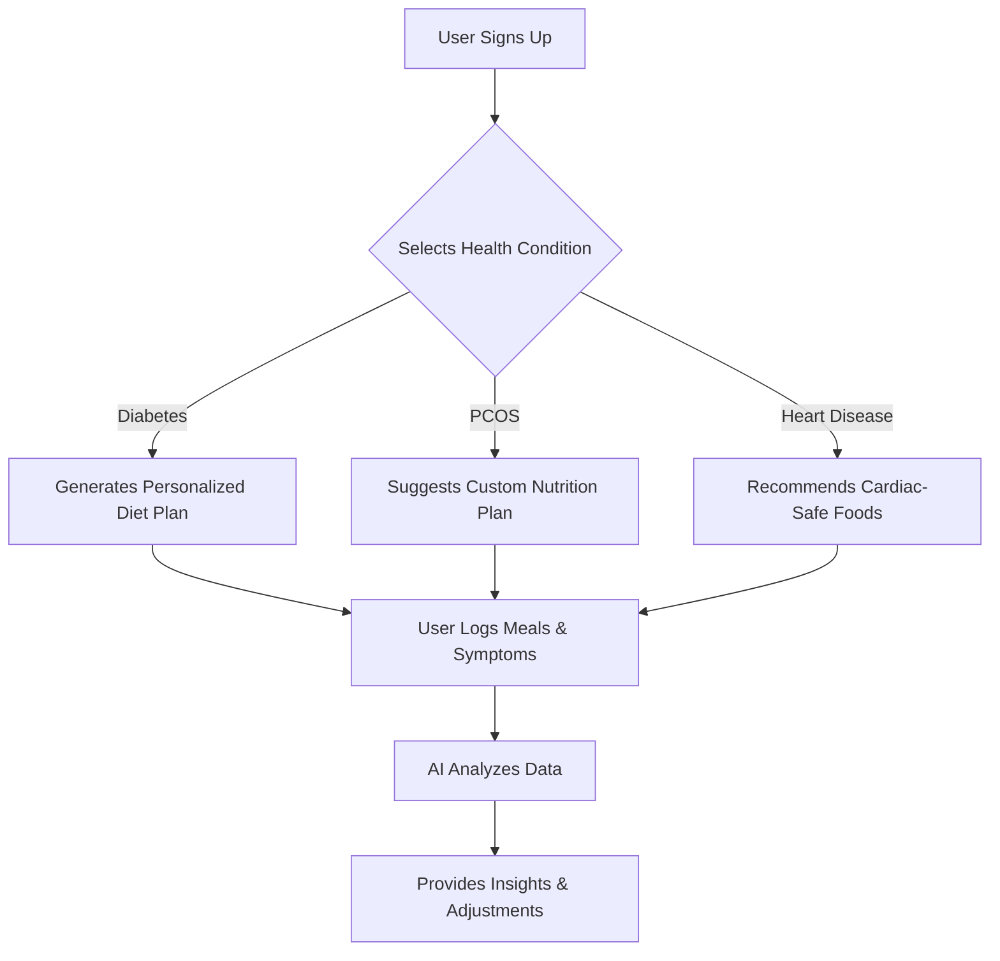
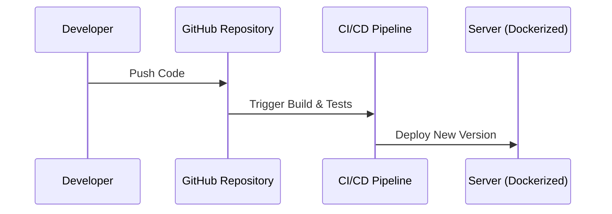

# **Open-Source AI for Personalized Healthcare & Nutrition**

## **Overview**
This project is an **open-source, AI-powered dietary and health management platform** that provides **disease-specific meal planning, food analysis, and health tracking**. It is built to assist individuals managing conditions such as **diabetes, PCOS, heart disease, kidney disorders, and other diet-dependent health issues**.

This platform is designed to be **fully decentralized, privacy-focused, and accessible to everyone** using only **open-source tools and libraries**.

## **Problems Being Solved**

### **1. Lack of Personalized Dietary Guidance**
- Many individuals struggle to find **personalized diet plans** suited to their medical conditions.
- Existing solutions provide **generic meal recommendations** without accounting for **preferences, allergies, or cultural food choices**.

### **2. High Cost & Data Privacy Issues**
- Most dietary and health tracking apps are **subscription-based or collect user data**.
- There is a lack of **privacy-respecting, open-source alternatives**.

### **3. Food Label Complexity**
- People with dietary restrictions often **struggle to interpret food labels**.
- The project provides **barcode scanning & ingredient analysis** for better food decision-making.

### **4. Health Monitoring Without Cloud Data Collection**
- Commercial apps **store user health data centrally**, posing privacy risks.
- This platform ensures **all AI processing happens locally on the user’s device**.

### **5. Open-Source Alternative to Proprietary AI Nutrition Apps**
- Most AI-driven health apps use **proprietary algorithms**.
- Our approach is fully **transparent and community-driven**.

## **Solution Overview**

- **AI-driven personalized meal plans** tailored to various health conditions.
- **Food recognition & barcode scanning** to analyze nutritional impact.
- **Health tracking system** that detects patterns in diet and symptoms.
- **Open-source and self-hostable** with complete data privacy.

## **How It Works**


---

## **Tech Stack**

### **Frontend**
- **Web App**: Next.js (React-based UI)
- **Mobile App**: React Native / Flutter
- **State Management**: Redux Toolkit / Zustand

### **Backend**
- **Framework**: FastAPI / Django
- **Database**: PostgreSQL / SQLite
- **Authentication**: OAuth (Keycloak / Auth.js)

### **AI & Machine Learning**
- **Meal Planning AI**: TensorFlow / PyTorch
- **Food Recognition**: Tesseract OCR, OpenCV
- **Data Analysis**: Pandas, NumPy

### **Deployment**
- **Containerization**: Docker + Kubernetes
- **CI/CD**: GitHub Actions
- **Self-Hosting Options**: Railway.app, Fly.io

---

## System Architecture
```mermaid
graph TD;
    A[User] -->|Inputs Health Data| B[Frontend (React/Flutter)]
    B -->|Sends Data| C[Backend (FastAPI)]
    C -->|Processes Request| D[ML Model (Diet Recommendation)]
    D -->|Returns Recommendations| C
    C -->|Sends Response| B
    B -->|Displays Diet Plan| A
    C -->|Stores Data Securely| E[Database (PostgreSQL)]
    B -->|Community Input| F[Open Data Contribution]
```

---

## **Deployment Workflow**


---

## **Future Enhancements**
- **Wearable Device Integration** (Sync with smartwatches & fitness trackers)
- **Multi-Language Support**
- **Decentralized Data Storage (IPFS-based optional feature)**

---

## **How to Contribute**
1. Clone the repository:
   ```sh
   git clone https://github.com/your-repo.git
   ```
2. Install dependencies:
   ```sh
   cd project-folder
   npm install
   ```
3. Start the development server:
   ```sh
   npm run dev
   ```
4. Submit a pull request with your contributions.

---

## **License**
This project is licensed under the **MIT License**, allowing for open collaboration and contribution.
