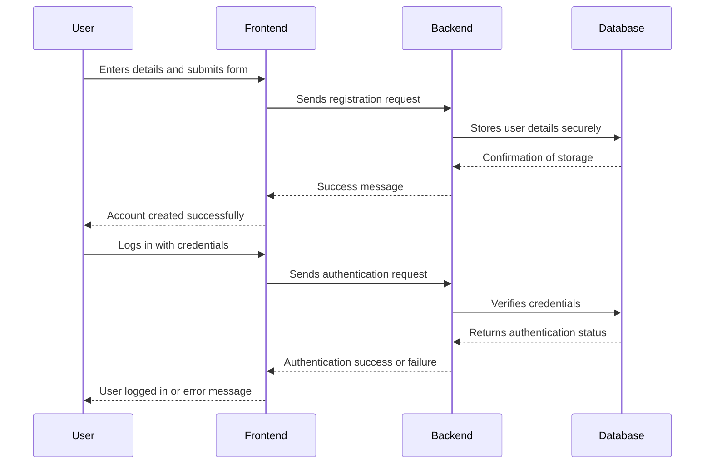
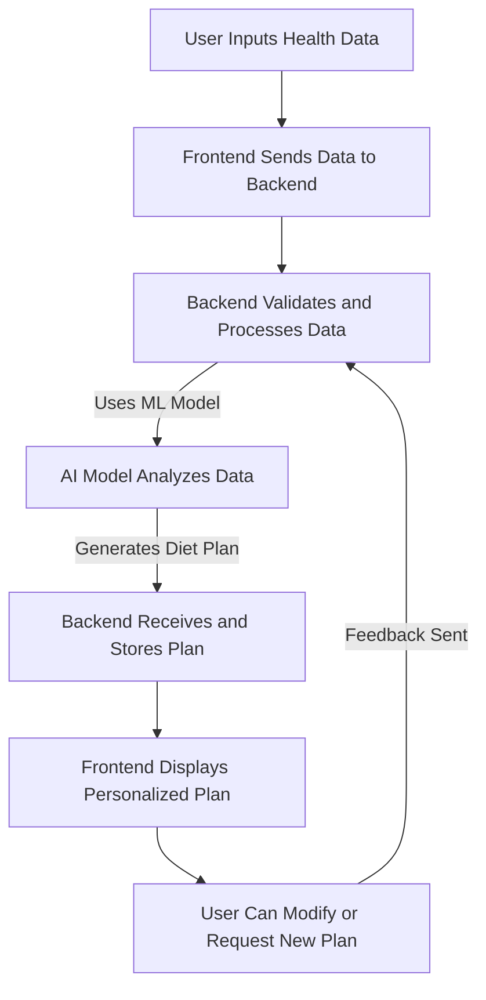
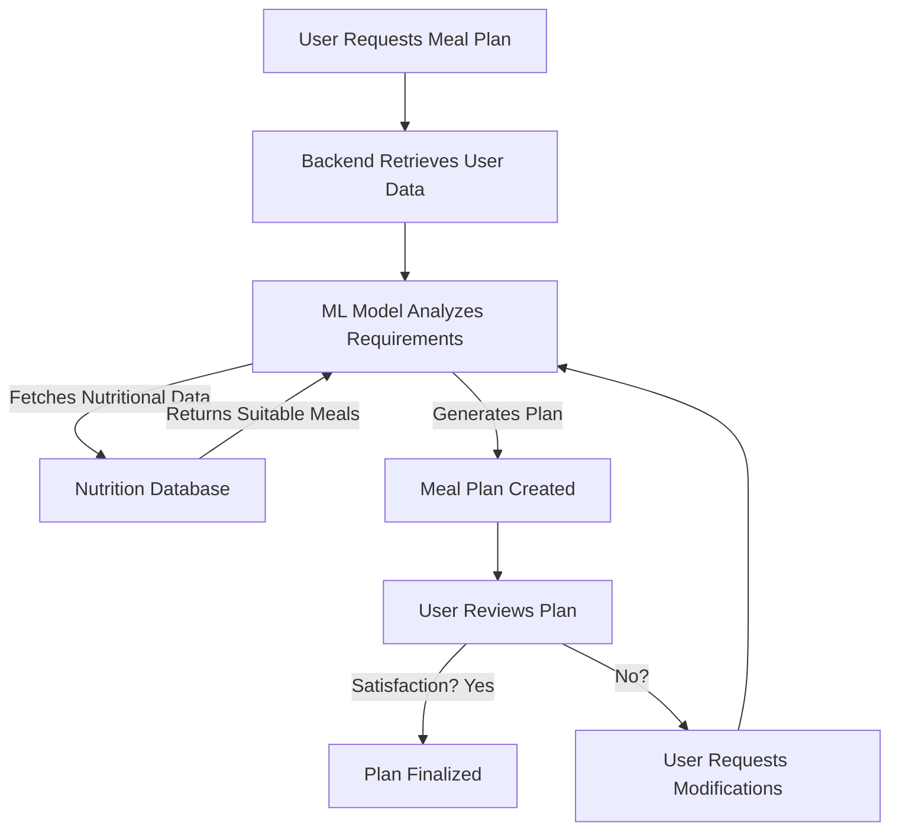
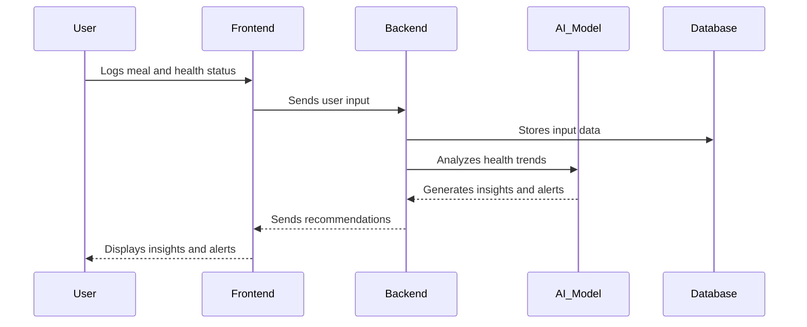
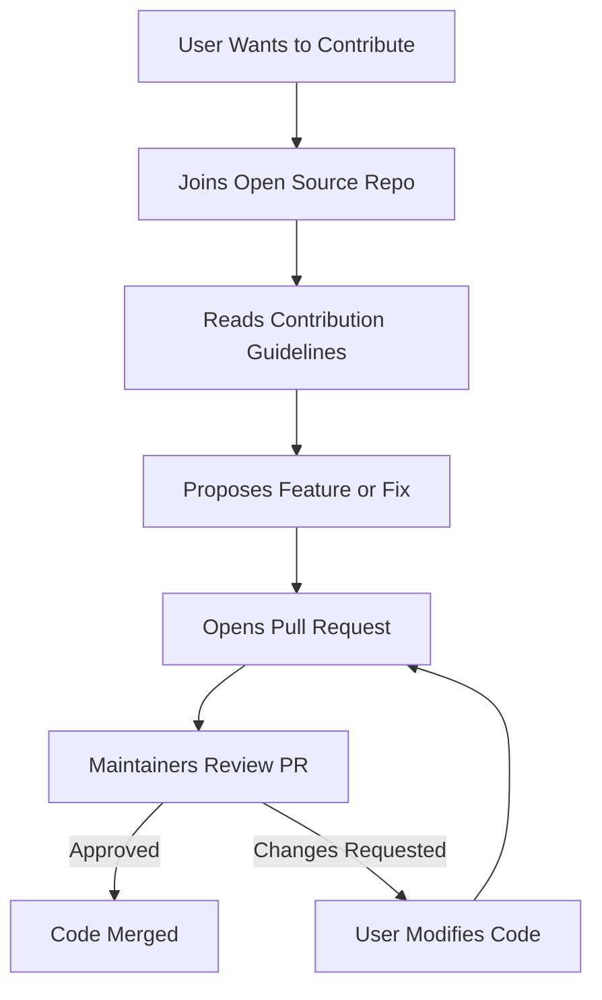

# Flowcharts for the Healthcare Diet Management System
## 1. System Architecture

```mermaid
graph TD;
    A[User] -->|Sends Requests| B[Frontend (React/Flutter)]
    B -->|API Calls| C[Backend (Flask/FastAPI)]
    C -->|Processes Requests| D[AI/ML Model]
    D -->|Sends Response| C
    C -->|Returns Data| B
    B -->|Displays Output| A
    C -->|Data Handling| E[Database (PostgreSQL/MongoDB)]
    E -->|Stores User Data| C
    C -->|External API Calls| F[Open Source Nutrition API]
    F -->|Returns Nutrition Data| C
```

## 2. User Registration and Authentication


## 3. User Input and Recommendation Workflow


## 4. Meal Recommendation and Adjustment Flow


## 5. Health Monitoring and Alerts


## 6. Community Contribution Workflow

